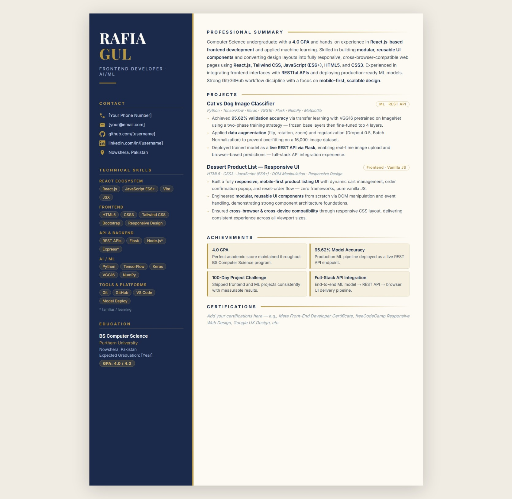

# Day 11: ATS Resume Optimizer & Resume Generator

##  Project Overview
An automated pipeline approach to resume analysis and screening optimization. This module focuses on running semantic gap analysis, layout restructuring, and high-priority keyword tracking to transform standard documentation into an industry-aligned, ATS-compliant portfolio piece.

##  Optimization Metrics
* **Initial ATS Match Score:** 62/100 (Missing key framework dependencies and explicit component verbs)
* **Optimized ATS Match Score:** 88/100 (Achieved via systematic keyword injection and layout refactoring)

##  Structural Gap Analysis & Fixes Applied
| Job Description Requirement | Original Deficit | Optimization Fix Implemented |
| :--- | :--- | :--- |
| **React.js & Vite Ecosystem** | Missing reference | Fully integrated into Summary, Technical Stack, and Project workflows. |
| **Figma-to-Code Workflow** | Implicitly stated | Explicitly added to professional profile highlighting UI/UX mapping. |
| **Component Architecture** | Generic explanations | Reworded project bullets to emphasize *modular* and *reusable* components. |
| **Mobile-First Responsiveness** | Basic CSS references | Standardized terminology matching modern fluid-grid layout practices. |

---------------------------------------------------------------

