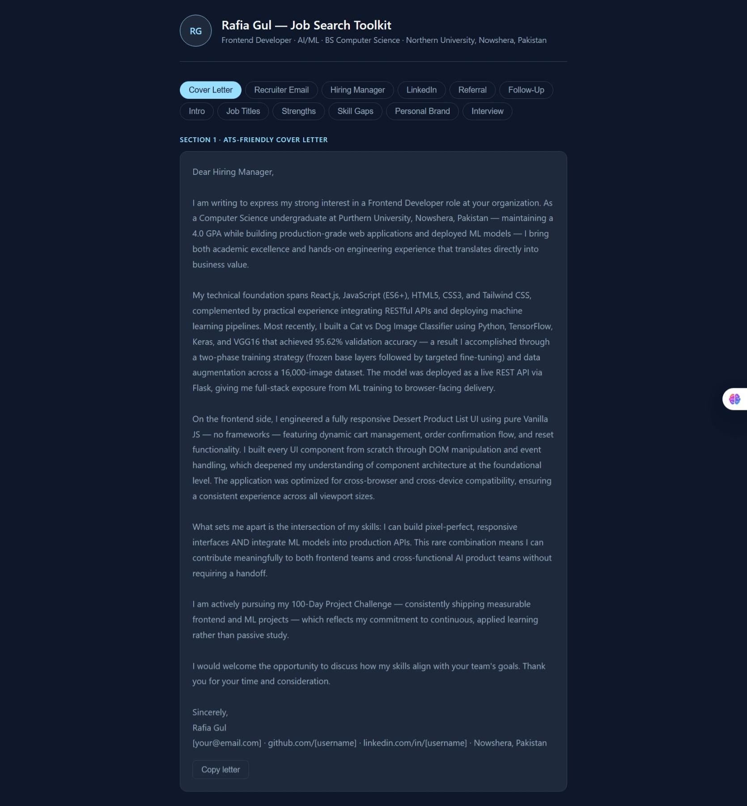
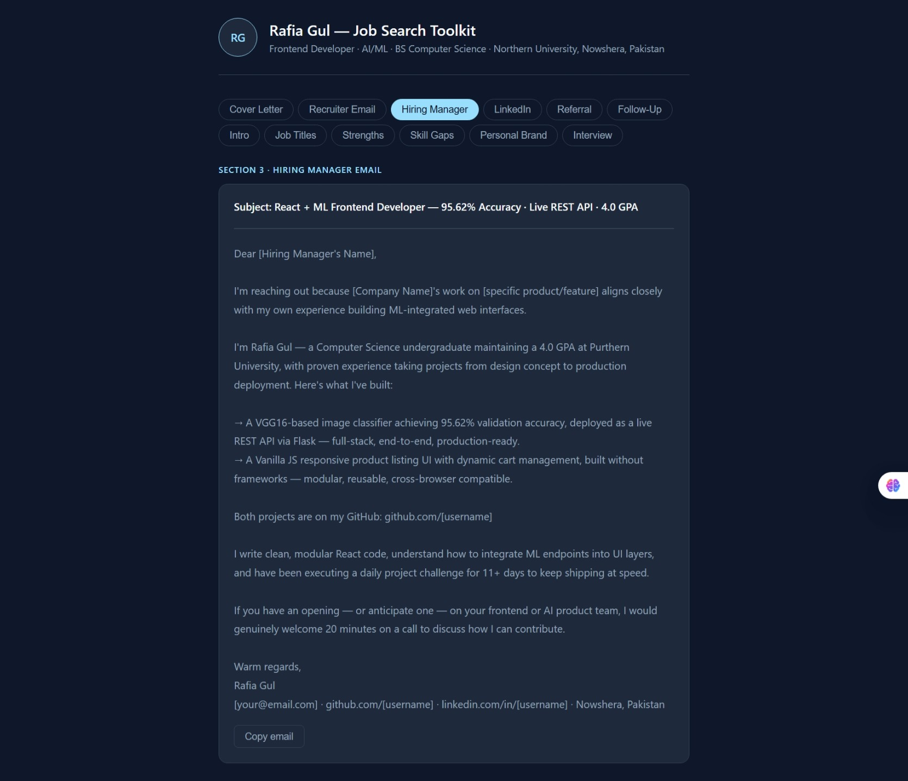
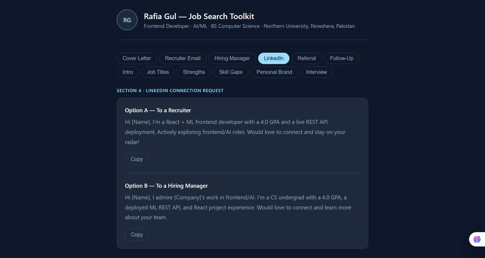
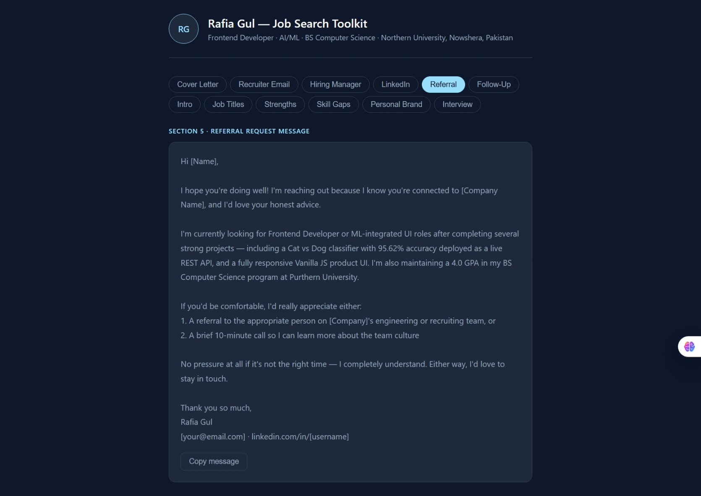

**Challenge!**

**Day 12-AI-Powered Job Search Toolkit**
---
 Project Overview

Welcome to day-12 **#60DaysAIChallenge** –The AI-Powered Job Search Toolkit is an intelligent career assistant that helps job seekers instantly generate ATS-friendly, recruiter-focused, and personalized job application content.

It simplifies the job search process by turning user skills and experience into professional cover letters, emails, LinkedIn messages, and interview preparation content using AI.

Built as part of my #60DaysAIChallenge, this project focuses on combining AI + career development + frontend engineering to solve a real-world problem: making job applications faster, smarter, and more effective.

---
**Key Features**

  ATS-Friendly Cover Letters

  Recruiter & Hiring Manager Emails

  LinkedIn Connection & Referral Messages

  Professional Introductions (Elevator Pitch)

  Job Role Recommendations

  Skill Gap Analysis

  Interview Talking Points Generator

---

 **5/12 Screenshots**
 
  
   
    
     

---
 **Purpose**

To help job seekers:

Save time in applications
Improve ATS compatibility
Build stronger personal branding
Prepare better for interviews

---

 **Author**

Rafia Gul
Frontend Developer | AI/ML Enthusiast

---
⭐ If you like this project, don’t forget to star the repo!
