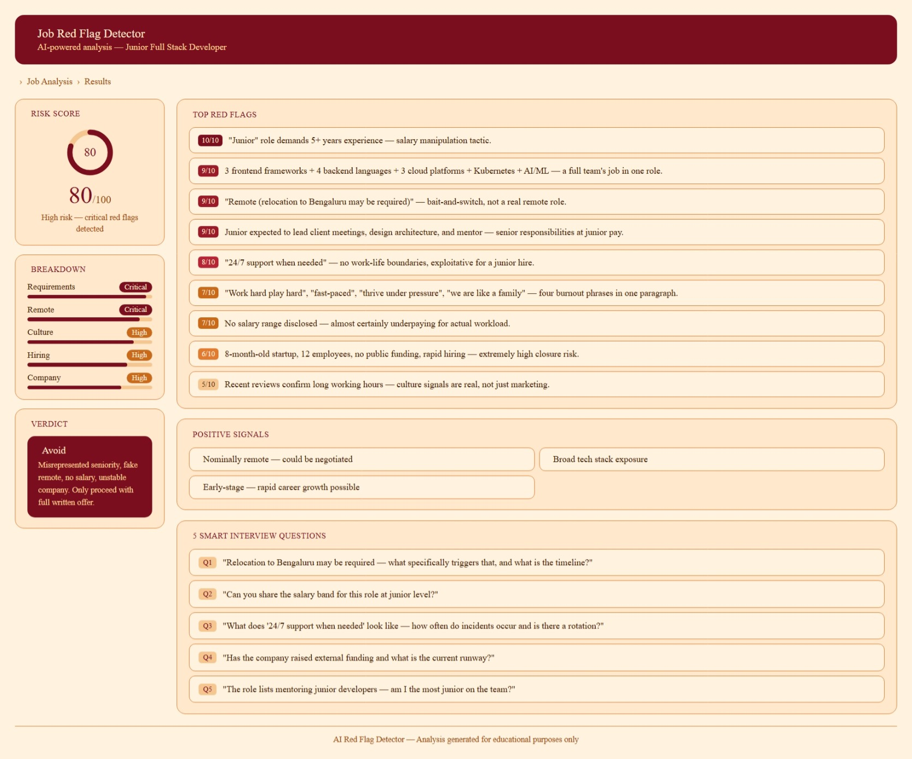

# Day-14|| AI Job Red Flag Detector

Analyze opportunities before investing your time.

##  Overview

The AI Job Red Flag Detector helps job seekers evaluate job opportunities before applying. Using AI, it identifies potential risks, misleading claims, and warning signs that may be hidden within job descriptions or company information.

This project demonstrates how AI can support smarter career decisions by helping candidates assess opportunities, validate employer claims, and prepare better questions for interviews.

## Features

* **Hidden Risk Detection** – Identify vague requirements, unrealistic expectations, and other job description red flags.
* **Company Reputation Analysis** – Evaluate company stability and credibility signals.
* **Remote Work Verification** – Detect misleading remote or hybrid work claims.
* **Interview Question Generation** – Create smart questions to validate concerns and gather important insights.

##  Tools & Skills

* Claude AI
* Prompt Engineering
* Natural Language Processing (NLP)
* Risk Analysis
* Career Intelligence

## What I Learned

* How to use AI for job opportunity analysis
* Identifying hidden risks in job postings
* Evaluating company-related signals
* Validating remote work opportunities
* Generating strategic interview questions

##  Key Takeaway

A job application is a two-way evaluation process. While companies assess candidates, candidates should also evaluate employers. AI can help uncover warning signs and support better career decisions before investing time in an opportunity.

---

###  Day 14 | 60 Days of AI Challenge

Building practical AI solutions to solve real-world career and decision-making challenges.

---

