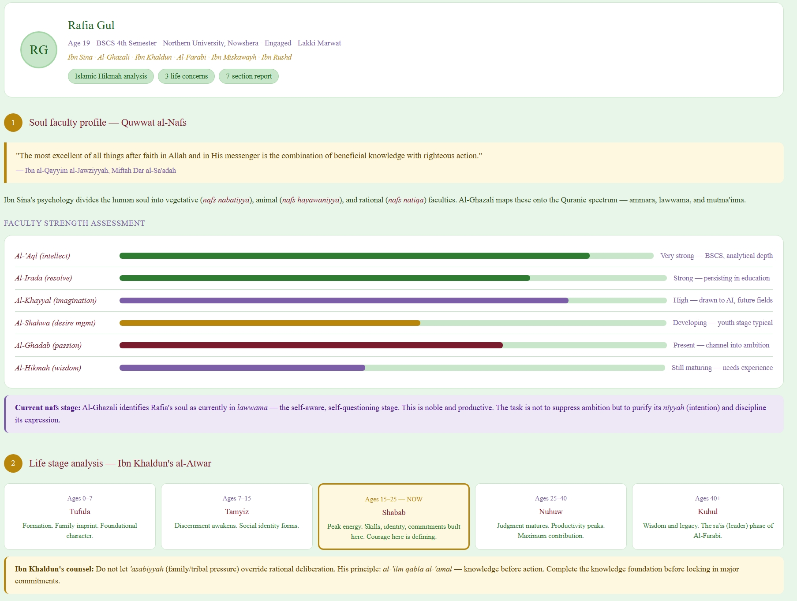
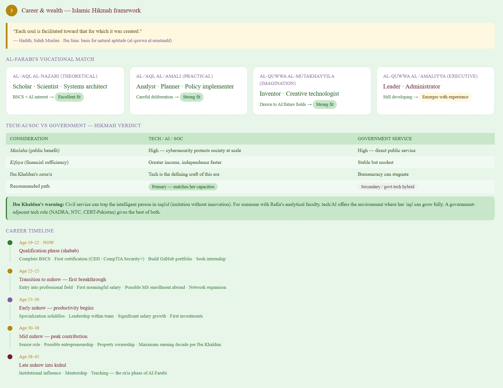
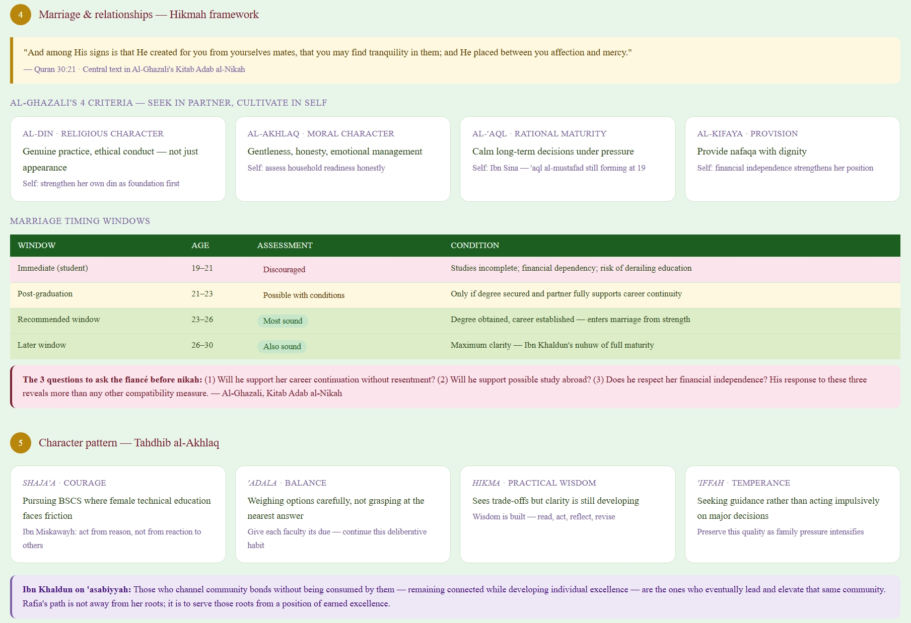
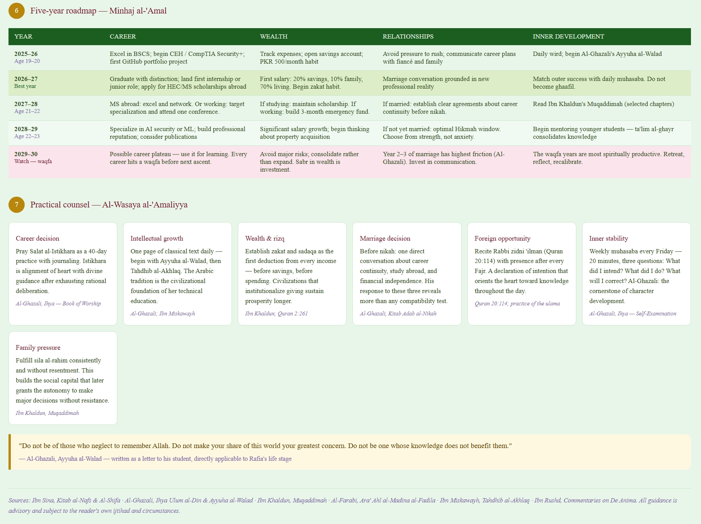

# Day 15 - AI Report Generator with Claude

This project was completed as part of the **ABTalks 60-Day AI Challenge (Day 15)**. The focus was on learning how Claude AI can generate comprehensive reports from structured inputs using multi-step reasoning and effective prompt design.

##  Overview

AI-powered report generation helps transform raw information into organized reports containing analysis, insights, forecasts, and recommendations.

---
##  Key Learnings

* The quality of inputs directly affects the quality of outputs.
* Multi-step reasoning improves report accuracy and depth.
* Well-structured prompts guide AI through complex tasks.
* AI can efficiently create detailed and professional reports.

---
##  Tools & Technologies

* Claude AI
* Prompt Engineering
* Structured Data Analysis

---
##  Outcome

Successfully explored how AI can analyze information, perform layered reasoning, and generate well-organized reports that support better decision-making.

---
##  Author

**Rafia Gul**
----
