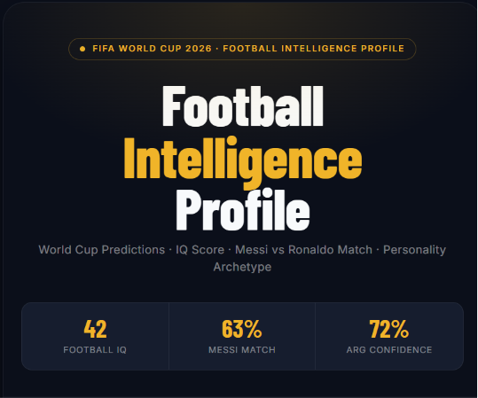
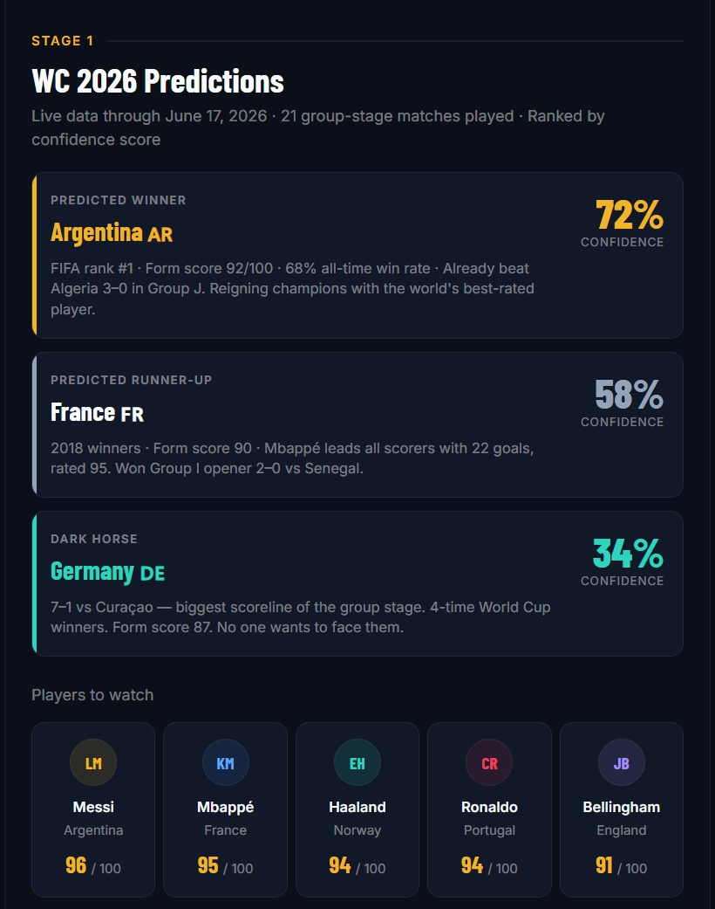
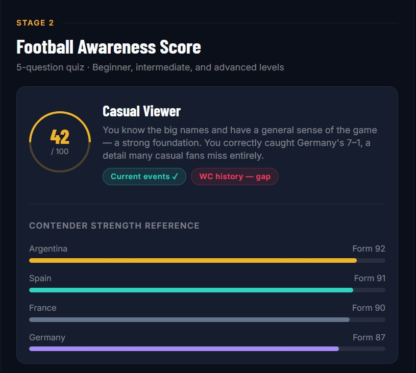
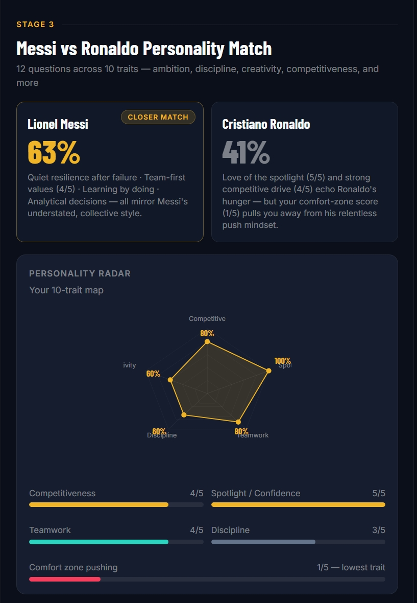
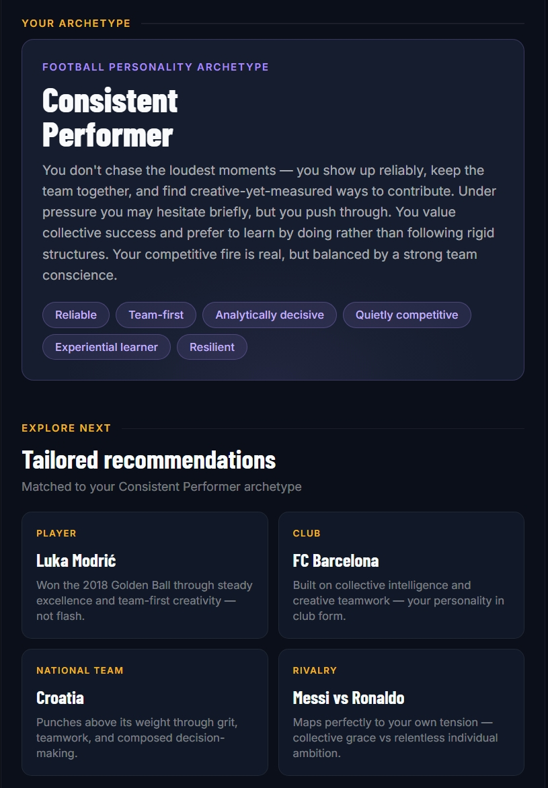
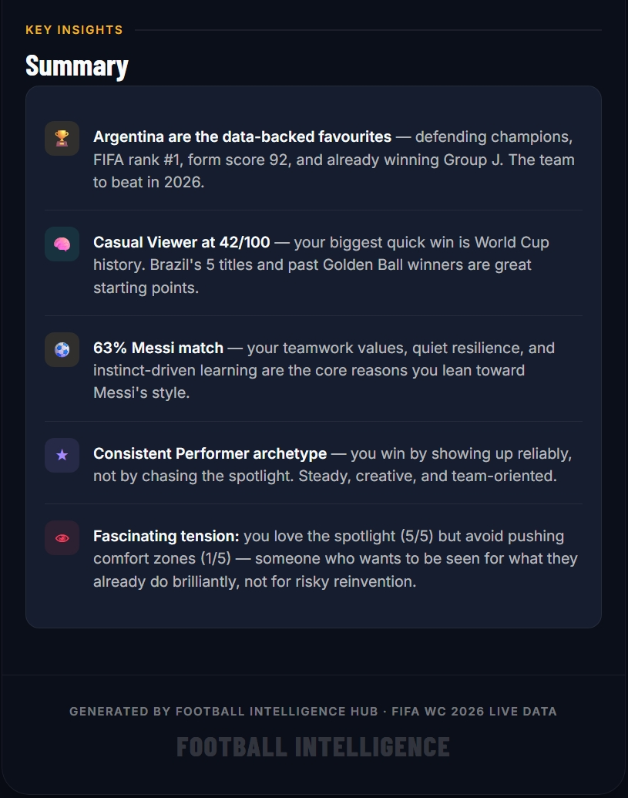

#  Day 19 - Football Intelligence Hub

## Overview

This project demonstrates how Claude AI can analyze football datasets to generate predictions, assess football knowledge, and create personalized football personality profiles.

## Objectives

* Analyze football performance and historical trends
* Generate FIFA World Cup 2026 predictions
* Create an interactive Football IQ Quiz
* Evaluate football awareness and knowledge levels
* Build a Messi vs Ronaldo Personality Match assessment
* Generate a complete Football Intelligence Profile

## Key Features

###  FIFA World Cup 2026 Prediction Report

* Most likely winner and runner-up
* Dark horse team prediction
* Players to watch
* Confidence scores and supporting evidence

###  Football IQ Quiz

* Beginner to advanced questions
* Football Awareness Score (0–100)
* Fan classification and knowledge analysis

###  Personality Assessment

* Messi vs Ronaldo compatibility analysis
* Football personality archetype identification
* Personalized football recommendations

## Learning Outcomes

* Sports data analysis with AI
* Prediction and reasoning workflows
* Interactive quiz generation
* Personality profiling techniques
* AI-powered personalization
* Screenshots and documentation

----

## Tools Used

* Claude AI
* Football Dataset Workbook
* GitHub

---

Part of the ABTalks 60-Day AI Challenge – Day 19 🚀
