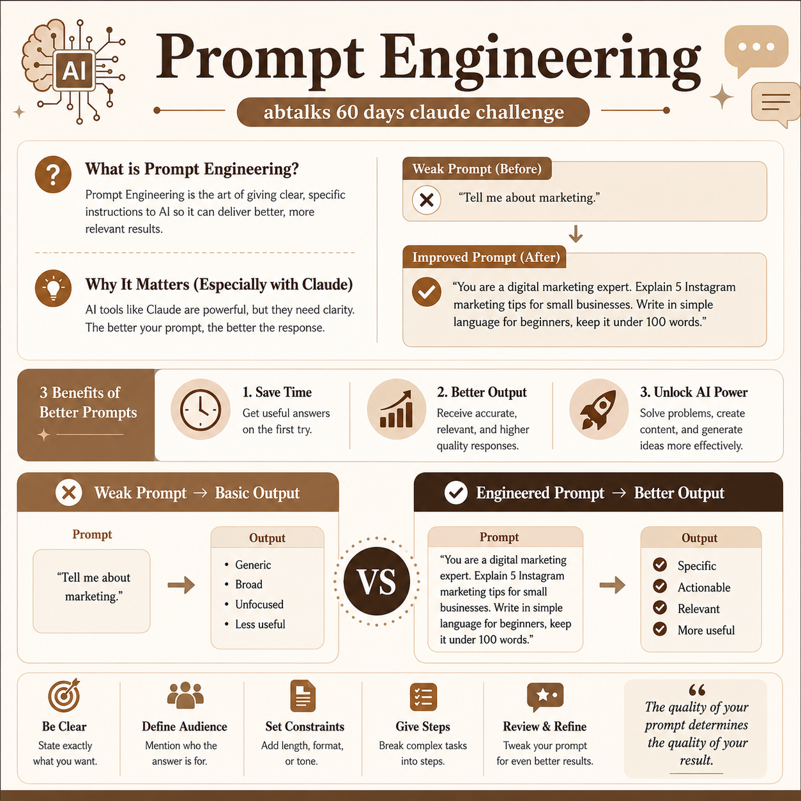

# 🧠 Day 2: Introduction to Prompt Engineering (The Art of Asking)

Welcome to Day 2 of my 60-Day Claude AI Challenge! Today, I dived into the core fundamentals of **Prompt Engineering**—learning how to communicate effectively with AI to unlock its maximum potential.

## 📝 What is Prompt Engineering?
Prompt Engineering is the practice of designing, structuring, and refining inputs (prompts) given to AI language models like Claude to get the most precise, actionable, and high-quality outputs. Think of it as knowing how to ask the right questions to a super-smart assistant.

## 🎯 Weak vs. Improved Prompt Example

| Feature | ❌ Weak Prompt | ✅ Engineered Prompt |
| :--- | :--- | :--- |
| **Prompt** | "Tell me about marketing." | "You are a digital marketing expert. Write 5 actionable Instagram content ideas for a small Pakistani bakery targeting young adults aged 18–25. Keep each idea under 50 words." |
| **Output** | A broad, generic essay that covers everything but helps with nothing specific. | 5 highly targeted, ready-to-use content ideas tailored exactly to the business audience. |

## ✨ 3 Practical Benefits of Better Prompts
1. **Saves Time:** Eliminates endless back-and-forth by getting the perfect response on the first try.
2. **Professional-Quality Output:** Unlocks expert-level responses by setting clear roles, contexts, and constraints.
3. **Unlocks AI's Full Potential:** Moves past basic conversational usage to tap into deep reasoning and structured outputs.

## 📸 Proof of Work & Image Concept
Today, I designed a minimal, Claude-inspired LinkedIn post concept (1080x1080) utilizing a professional color palette (brown, beige, and cream) to visually compare a weak prompt vs. an engineered prompt for this 60-day challenge.

The visual screenshot of today's prompt design and workflow with Claude is attached below:

---
*Day 2 successfully completed! Learning how to guide the AI step-by-step is already changing how I approach problem-solving.*
