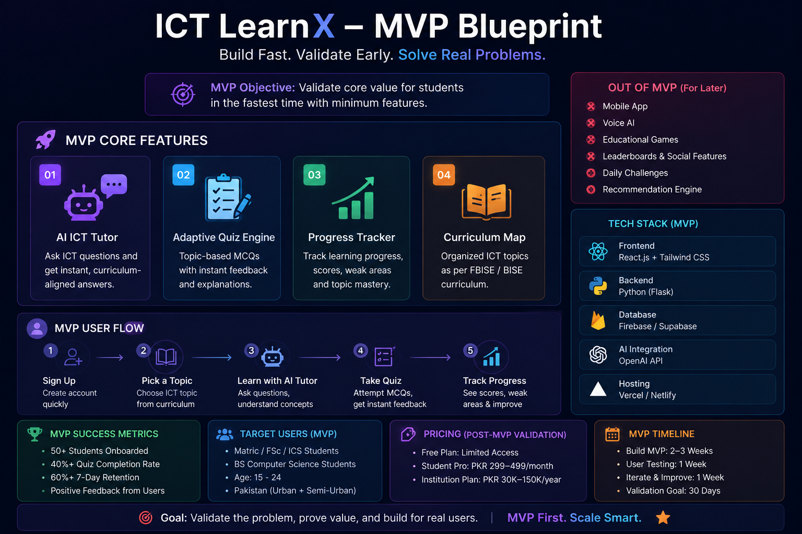

# Day 23 – Customer & MVP Blueprint |  ABTalks 60-Day Coding Challenge

## Startup Idea

**ICT LearnX** – An AI-powered interactive learning platform for ICT students in Pakistan.

## Objective

Identify target customers, understand their pain points, and define a focused MVP that solves the most important problems.

## Key Findings

* Students need interactive ICT learning.
* Existing solutions lack personalization and curriculum alignment.
* AI Tutor and Smart Quizzes provide the highest value.

## MVP Features

✅ AI ICT Tutor

✅ Adaptive Quiz Engine

✅ Progress Tracker

✅ Curriculum-Aligned Topic Map

## What Not to Build (v1)

❌ Mobile App

❌ Voice AI

❌ Educational Games

❌ Leaderboards

❌ Social Features

## Target Users

* Matric / FSc / ICS Students
* BS Computer Science Students
* ICT Self-Learners
* Educational Institutes

## Key Learning

> Build the smallest product that proves value.

Focus on solving customer problems before adding advanced features.

## Outcome

Created a complete Customer & MVP Blueprint including customer personas, pain points, MVP strategy, pricing hypothesis, risk assessment, and a 30-day action plan.

**Author:** Rafia Gul
