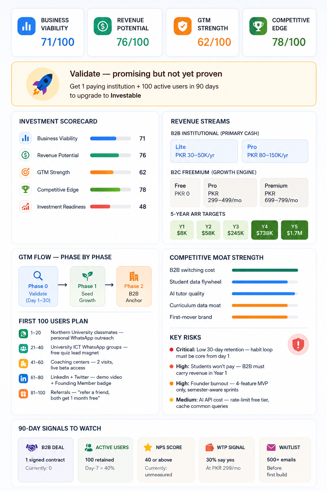

# Day 24 – Business Strategy Report | ABTalks 60-Day Coding Challenge 

## Startup

**ICT LearnX** – An AI-powered interactive learning platform for ICT students.

## Objective

Evaluate whether the startup can become a sustainable and scalable business.

## Key Areas Covered

* Business Model Canvas
* Revenue & Pricing Strategy
* Go-To-Market Plan
* Customer Acquisition Strategy
* First 100 Users Plan
* Competitive Analysis
* Investment Readiness

## Key Insight

> A great product without distribution is still a failed business.

## Results

* Business Viability: 71/100
* Revenue Potential: 76/100
* GTM Strength: 62/100
* Competitive Strength: 78/100
* Investor Readiness: 48/100
* 

### Final Verdict

🟡 Validate – Promising but not yet proven.

The startup shows strong potential but requires customer validation, user growth, and institutional partnerships before becoming investment-ready.

**Author:** Rafia Gul

