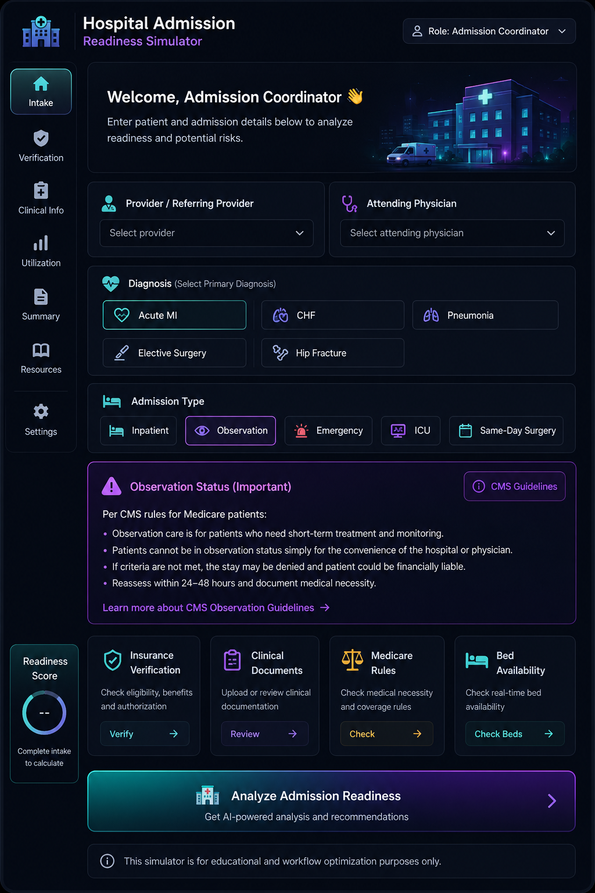

# Day 28 – Hospital Admission Readiness Simulator |  ABTalks 60-Day Coding Challenge

## Project Overview

Built an interactive Hospital Admission Readiness Simulator that teaches healthcare admission workflows through real-world scenarios and decision-making.

## Features

* Admission Readiness Analysis
* Prior Authorization Management
* Insurance Verification
* Bed Assignment Workflow
* Documentation & Consent Tracking
* Risk Assessment
* Care Coordination
* Timeline Progress Tracker
* Governance Snapshot
* Final Admission Decision

## Technologies Used

* HTML
* Tailwind CSS
* Vanilla JavaScript

## Key Learning

> Efficient hospital admissions depend on collaboration between clinical and administrative teams, ensuring documentation, insurance, and patient readiness are completed before admission.

## Outcome

Developed a browser-based healthcare workflow simulator that demonstrates admission readiness, operational coordination, and healthcare decision-making through an interactive user experience.

**Author:** Rafia Gul

