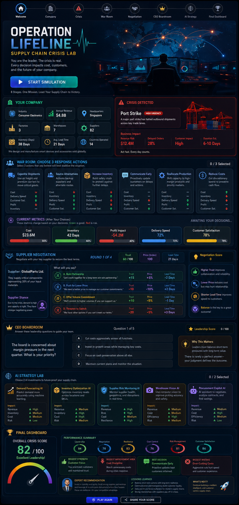

# Day 29 – Operation Lifeline: Supply Chain Crisis Lab | ABTalks 60-Day Coding Challenge 

## Project Overview

Developed an interactive supply chain simulation that allows users to experience enterprise decision-making during operational crises. Players analyze business disruptions, negotiate with suppliers, make leadership decisions, and improve organizational resilience.

## Features

* Random Company Profile Generator
* Dynamic Supply Chain Crisis Scenarios
* Crisis Response Decision System
* Supplier Negotiation Simulator
* CEO Leadership Assessment
* AI Strategy Investment Selection
* Executive Performance Dashboard
* Business KPI Tracking
* Responsive Dark-Themed Interface

## Technologies Used

* HTML
* CSS
* React (CDN)
* JavaScript
* Babel JSX

## Key Learning

> Strong supply chains depend on strategic planning, effective risk management, supplier collaboration, and data-driven decision-making. AI can significantly improve forecasting, inventory optimization, and operational resilience.

## Outcome

Built a complete browser-based enterprise simulation that demonstrates supply chain crisis management through interactive business scenarios and executive decision-making.

**Author:** Rafia Gul

