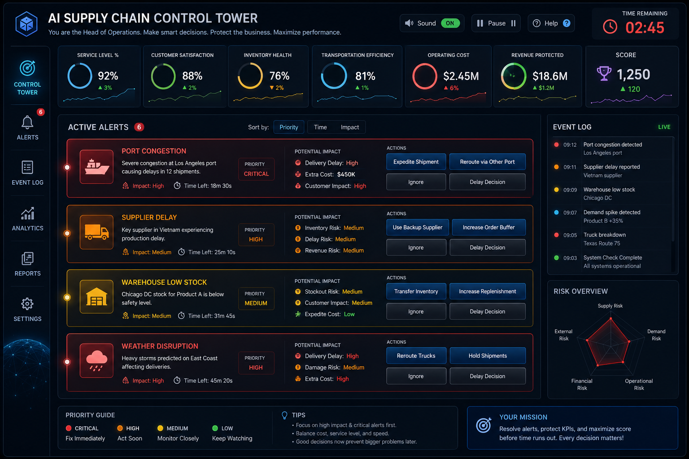

# Day 31 – AI Supply Chain Control Tower | 60DayClaudeChallenge

## Overview
Built an interactive **AI Supply Chain Control Tower** using HTML, CSS, and Vanilla JavaScript.

The application simulates the role of a **Head of Operations**, where users monitor live supply chain disruptions, prioritize operational alerts, and make strategic decisions that impact business KPIs.

## Features
- Live operational alerts
- Real-time KPI dashboard
- Decision-based gameplay
- Countdown timer
- Priority-based incident management
- Performance scoring
- Final operational summary
- Responsive dark-themed UI
- Replay functionality

## Technologies Used
- HTML
- CSS
- Vanilla JavaScript

## Key Learning
This project helped me understand how Supply Chain Control Towers enable organizations to monitor operations, respond to disruptions, optimize KPIs, and improve business resilience through data-driven decision making.

