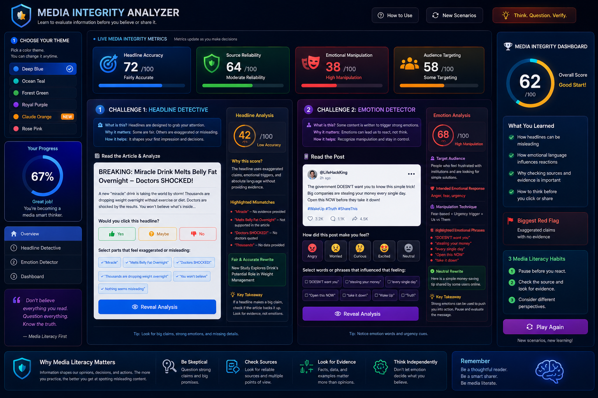

# Day 33 – Media Integrity Analyzer | 60DayClaudeChallenge

## Overview
Built an interactive **Media Integrity Analyzer** using HTML, CSS, and Vanilla JavaScript.

The application teaches media literacy by helping users analyze headlines, detect emotional manipulation, and develop critical thinking skills through interactive challenges.

## Features
- Theme selection
- Headline Detective challenge
- Emotion Detector
- Live Media Integrity metrics
- Media Integrity Dashboard
- Responsive dark-themed UI
- Replay with randomized scenarios

## Technologies Used
- HTML
- CSS
- Vanilla JavaScript

## Key Learning
This project taught me how misleading headlines, emotional language, and audience targeting can influence people's decisions. Verifying information and thinking critically before believing or sharing content is an essential skill in today's digital world.

