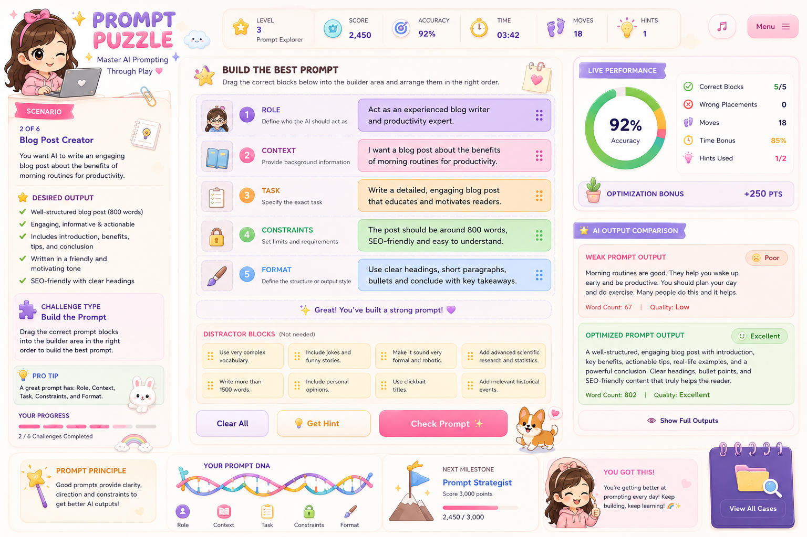

# 🧩 Day 35 – Prompt Puzzle: Master AI Prompting Through Play | ABTalks 60-Day Claude Challenge

## 📌 Project Overview

Prompt Puzzle is an interactive educational web application that teaches prompt engineering through gamified challenges. Users learn how to create effective AI prompts by solving puzzles, optimizing prompts, and comparing AI-generated outputs.

---

## ✨ Features

- Interactive Prompt Building Challenges
- Prompt Optimization Exercises
- Weak vs Optimized Prompt Comparison
- Drag-and-Drop Gameplay
- Live Performance Scoring
- Accuracy, Time & Optimization Tracking
- Prompt Performance Report
- Personalized Feedback
- Randomized Scenarios
- Replay Functionality
- Premium Dark Modern UI
- Responsive Design

---

## 🛠 Technologies Used

- HTML5
- CSS3
- JavaScript
- React (CDN)

---

## 🎯 Learning Outcomes

Through this project I learned:

- How effective prompt engineering improves AI responses.
- The importance of providing clear roles, context, and constraints.
- Why vague prompts produce weaker outputs.
- How optimized prompts increase response quality.
- Building interactive educational applications using modern frontend technologies.

---

## 🚀 Outcome

This project strengthened my understanding of prompt engineering by combining learning with interactive gameplay. It also enhanced my frontend development skills while creating a practical AI learning experience.

---

