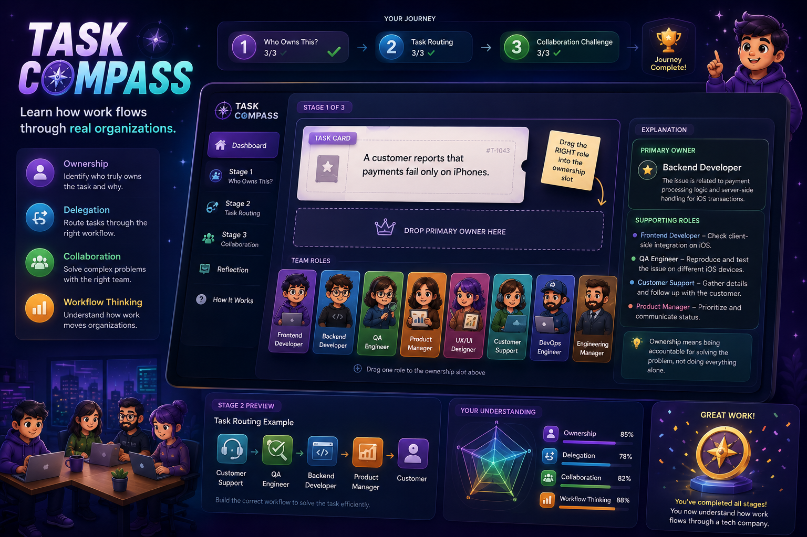

# 🚀 Day 37 – Task Compass

## 📌 Project
**Task Compass – Learn How Work Flows Through Real Organizations**

An interactive educational web application that simulates how tasks move through a modern **Tech Company**. The goal is to teach ownership, delegation, collaboration, and workflow management through engaging drag-and-drop activities.

---

## 🎯 Objective

Instead of testing job titles, this simulator helps users understand:

- Task Ownership
- Delegation
- Cross-team Collaboration
- Organizational Workflow
- Decision Making

The experience is designed like a modern strategy game rather than a traditional quiz.

---

## ✨ Features

### 🧩 Stage 1 – Who Owns This?
- Analyze real workplace tasks
- Drag and drop the correct owner
- Learn why each role is responsible
- Discover supporting team members

### 🔄 Stage 2 – Task Routing
- Build the workflow for incoming tasks
- Arrange departments in the correct order
- Watch task flow animations
- Understand how work moves across teams

### 🤝 Stage 3 – Collaboration Challenge
- Solve complex workplace situations
- Assign multiple departments
- Learn communication flow
- Explore collaborative problem-solving

---

## 📊 Final Reflection

The simulator provides personalized insights on:

- Ownership Understanding
- Delegation Skills
- Collaboration Awareness
- Workflow Thinking

Instead of giving a simple score, it highlights strengths and suggests areas for improvement.

---

## 🛠️ Technologies Used

- HTML5
- CSS3
- Vanilla JavaScript

---

## 🎨 UI Highlights

- Premium Dark Theme
- Glassmorphism Design
- Animated Gradient Backgrounds
- Interactive Drag & Drop
- Smooth Animations
- Progress Tracking
- Responsive Layout
- Modern Cards & Work Tickets

---

## 📚 Key Learnings

- Most workplace problems require teamwork.
- Clear ownership reduces confusion.
- Effective delegation improves productivity.
- Good communication keeps projects moving.
- Understanding workflows is essential in real organizations.

---

## 📸 Screenshots

