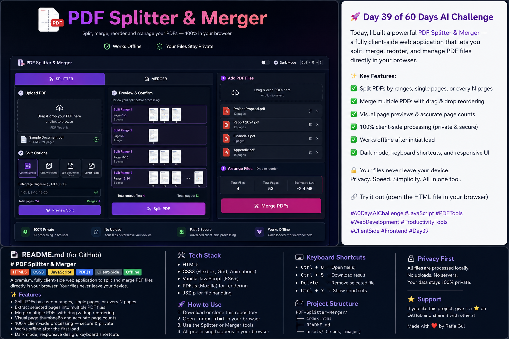

## Day-39 PDF Splitter & Merger

**A premium browser-based PDF Splitter & Merger built using HTML, CSS, and JavaScript**

This application enables users to split, extract, reorder, and merge PDF documents entirely within their browser. All processing happens locally on the user's device, ensuring complete privacy and fast performance without requiring any backend server.

## Features

**PDF Splitter**
Upload PDF files
Automatic page count detection
Visual page thumbnails
Document preview before processing
Split by custom page ranges
Split after selected pages
Split every N pages
Extract selected pages
Create multiple split ranges
Real-time validation of page ranges
Preview output structure before generating PDFs

**PDF Merger**
Upload multiple PDF files
Drag & Drop support
Sortable file list
Reorder PDFs before merging
Display total files and page count
Merge PDFs into a single document
Download merged PDF instantly

**Additional Features**
100% Client-side processing
No file uploads
Privacy-first design
Responsive layout
Modern Dark Mode
Smooth animations
Loading indicators
Accessibility support
Keyboard shortcuts
Offline support after the initial page load
Professional commercial-style UI/UX

 **Tech Stack**
HTML5
CSS3
JavaScript (ES6+)
PDF.js
pdf-lib
SortableJS

**Learning Outcomes**

Through this project, I practiced:

Advanced JavaScript
Client-side PDF manipulation
Drag & Drop functionality
File handling APIs
Responsive UI/UX Design
DOM manipulation
Accessibility best practices
Browser performance optimization

**Future Improvements**
Password-protected PDF support
Rotate pages
Delete pages
Compress PDF
Watermark PDFs
OCR integration
PDF encryption
Batch processing
**ScreenShot**

