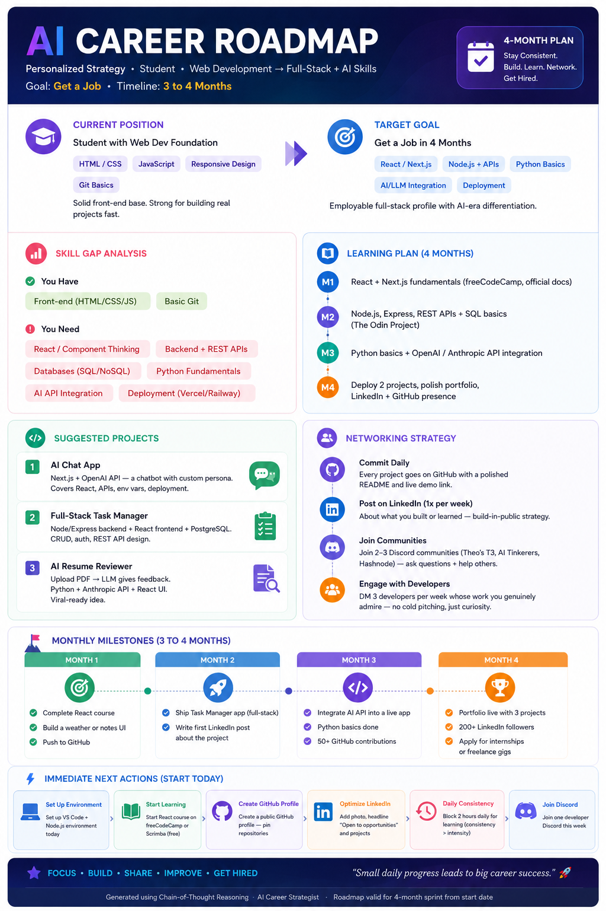

#  Day 4 Challenge: Chain-of-Thought Prompting

##  Task Overview
Today's challenge focused on **Chain-of-Thought (CoT) Prompting**—instructing Claude to think step-by-step before delivering an output. I applied this technique by simulating an *Elite AI Career Strategist* to analyze my current web development foundation and build a hyper-targeted 4-Month Acceleration Roadmap.

---

##  Visual Career Roadmap
The complete structured plan, skill gap analysis, and monthly milestones were compiled into an executive infographic.

>  **Artifact Reference:** The generated high-fidelity roadmap is saved as .

---

##  Key Learnings & Observations

* **The Power of CoT:** Instead of giving generic timeline advice, forcing Claude to evaluate my specific background first resulted in a roadmap that perfectly bridges modern frontend thinking (React/Next.js) with backend frameworks and AI API integrations.
* **Core Insight:** To move from a student baseline to a job-ready developer in 4 months, the fastest path is skipping isolated tutorials and building **3 high-yield projects**: an *AI Chat App*, a *Full-Stack Task Manager*, and an *AI Resume Reviewer*.
* **Tool of the Day:** Used the **Capsule Hub** Chrome extension to store this advanced CoT career prompt so I can re-run and audit my progress next semester.

---

*Generated using Chain-of-Thought Reasoning | 60-Day Claude AI Challenge*
