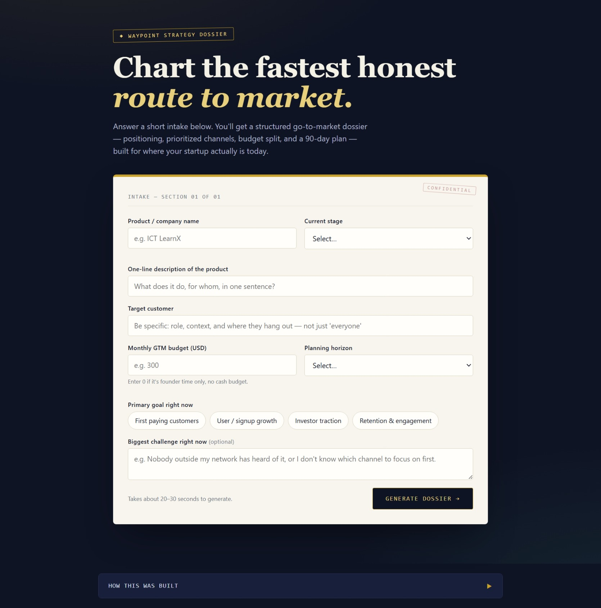

# 🤖 Day 40 – AI Assistant Builder |  ABTalks 60-Day Claude Challenge
er

## 📌 Project Overview

This project is an **AI-powered Go-to-Market (GTM) & Growth Strategy Assistant** designed to help early-stage founders create effective launch and growth strategies.

The assistant interviews users through a guided form, analyzes their startup information, and generates a structured strategy report containing positioning, marketing channels, budget allocation, growth roadmap, KPIs, and AI-powered recommendations.

---

# 🎯 Objectives

* Build a specialized AI assistant for startup founders.
* Create a guided user experience instead of a generic chatbot.
* Generate structured business strategy reports.
* Demonstrate prompt engineering and frontend development skills.
* Deliver a responsive single-page AI application.

---

# ✨ Features

* 🤖 AI-Powered GTM Strategy Assistant
* 📝 Guided Business Intake Form
* 🎯 Target Audience Analysis
* 💎 Value Proposition Suggestions
* 📢 Marketing Channel Recommendations
* 💰 Budget Planning
* 📅 30/60/90-Day Action Plan
* 📊 Structured Strategy Report
* 📈 Growth Recommendations
* ⚠️ Risk Identification
* 🌙 Responsive Modern UI
* 📱 Mobile-Friendly Design

---

# 🛠️ Technologies Used

* HTML5
* CSS3
* JavaScript (Vanilla)
* Claude AI
* Prompt Engineering

---

# 📚 What I Learned

* Designing AI assistants for real-world business scenarios.
* Creating production-quality system prompts.
* Building guided workflows for better user experience.
* Generating structured AI reports from business inputs.
* Integrating AI concepts into modern frontend applications.

---

# 📸 Screenshots

