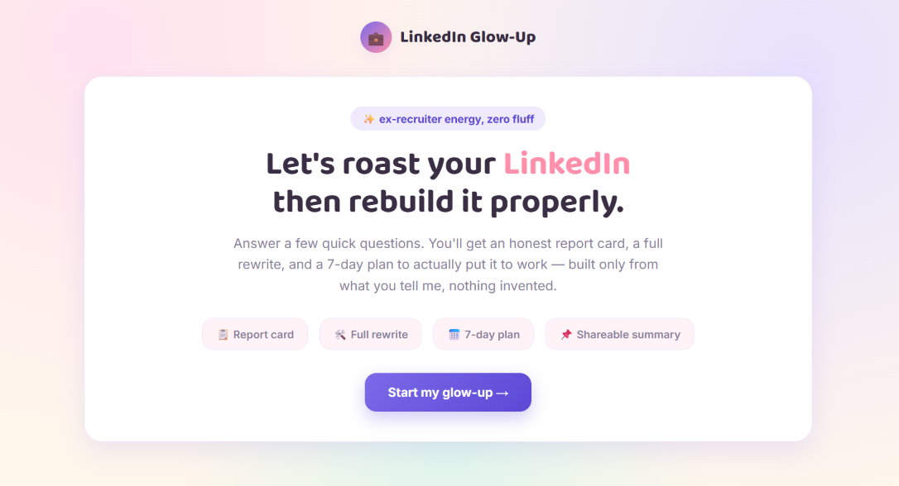

# 🤖 AI-Powered LinkedIn Profile Optimizer

An interactive AI-powered web application that helps users transform their LinkedIn profiles into recruiter-friendly profiles through personalized analysis and optimization.

## 📌 Overview

This project simulates an experienced LinkedIn recruiter and personal branding consultant. It analyzes a user's profile, identifies weak areas, provides detailed feedback, rewrites important sections, and creates a 7-day LinkedIn growth strategy.

## ✨ Features

* 📊 LinkedIn Profile Report Card
* 🔥 Honest Profile Roast
* 🎯 SEO-Optimized Headlines
* ✍️ Professional About Section Rewrite
* 💼 Experience Optimization
* 🧠 Skills & Keyword Recommendations
* 📈 Before vs After Score Comparison
* 📅 7-Day LinkedIn Activation Plan
* 📄 Shareable Learning Summary
* 🎨 Interactive HTML Interface

## 🛠️ Technologies Used

* HTML5
* CSS3
* JavaScript
* AI Prompt Engineering

## 🎯 Learning Outcomes

Through this project, I learned:

* Prompt Engineering
* Personal Branding Fundamentals
* LinkedIn Profile Optimization
* AI-Assisted Career Development
* Interactive Web Application Development

## 🌟 Future Improvements

* OpenAI API integration
* PDF report export
* Dark/Light mode
* Authentication
* Save profile history
* Multiple optimization templates

  

