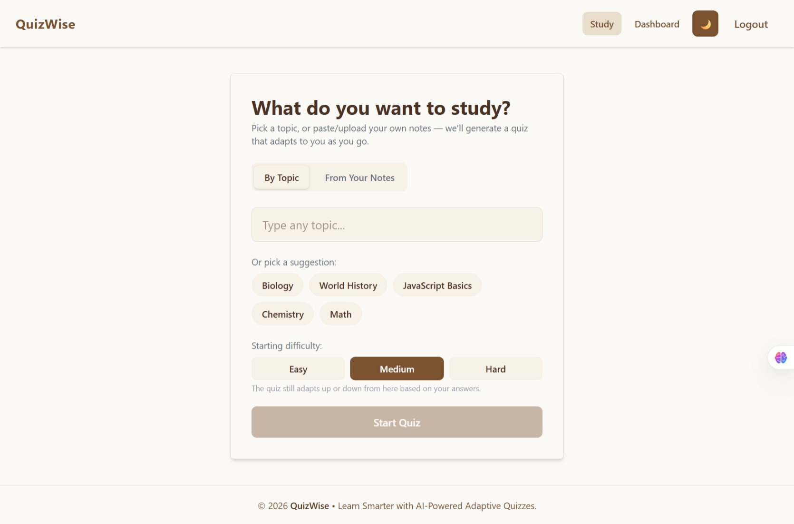
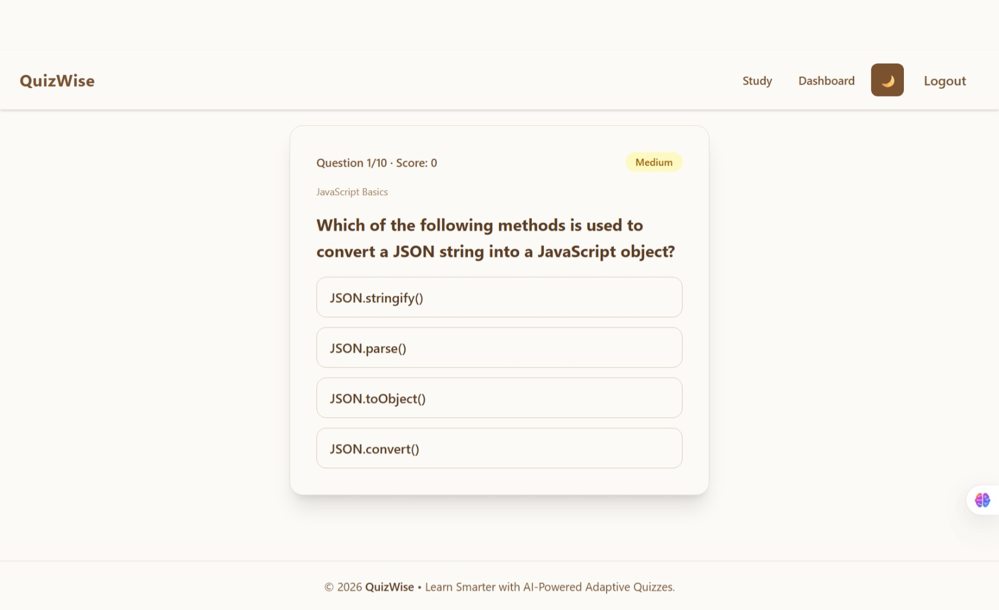
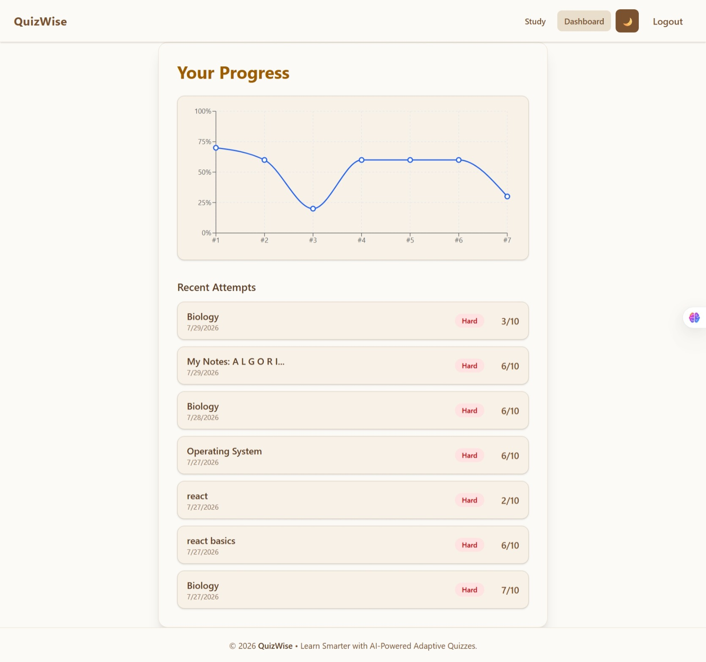

#  AB Talks 60-Day Claude AI Challenge — Completed

> *"From learning AI to shipping a production-ready application."*

##  Challenge Completed

I successfully completed the **AB Talks 60-Day Claude AI Challenge**, a structured learning journey covering AI fundamentals, prompt engineering, reasoning, automation, AI-assisted development, and modern software engineering.

The final milestone was a **10-Day Capstone Sprint**, where I designed, developed, optimized, documented, deployed, and released **QuizWise v1.0.0**—a production-ready AI-powered adaptive quiz platform.

---

#  QuizWise v1.0.0

**QuizWise** is an AI-powered adaptive learning platform that transforms study notes into personalized quizzes, helping learners practice smarter and track their progress through interactive analytics.

###  Live Demo
 **https://quizwise-1e1cc.web.app**

### GitHub Repository
**https://github.com/gulrafia93-rgb/QuizWise**

---

##  Features

- AI-powered adaptive quiz generation
-  PDF note upload and quiz creation
-  Personalized starting difficulty
-  Interactive progress analytics dashboard
-  Quiz history tracking
-  Dark & Light theme support
-  Fully responsive design
-  Performance optimized
-  Supabase backend integration
-  Firebase Hosting deployment

---

##  Tech Stack

| Frontend | Backend | Deployment | Tools |
|-----------|----------|------------|-------|
| React | Supabase | Firebase Hosting | Git |
| Vite | JavaScript | Firebase | GitHub |
| Tailwind CSS | Recharts | | VS Code |

---

##  Project Preview

| Home | Quiz | Dashboard |
|------|------|-----------|
|  | |  |

---

##  Skills Demonstrated

- AI Foundations
- Prompt Engineering
- AI-Assisted Development
- Product Thinking
- Frontend Development
- React Architecture
- UI/UX Design
- State Management
- Responsive Web Design
- Debugging
- Performance Optimization
- Deployment
- Documentation
- Open Source Workflow

---

##  Key Takeaway

This challenge taught me that building great software is much more than writing code. It requires thoughtful planning, continuous iteration, effective debugging, documentation, testing, deployment, and a user-first mindset.

Building **QuizWise** strengthened my technical skills while giving me practical experience in delivering a production-ready application from idea to release.

---

##  Challenge Journey

- Completed **AB Talks 60-Day Claude AI Challenge**
- Successfully finished the **10-Day Capstone Sprint**
- Designed and built **QuizWise v1.0.0**
- Deployed a production-ready web application
- Created complete project documentation
- Published the project on GitHub

---

## Acknowledgements

A sincere thank you to **AB Talks** for organizing this incredible learning experience and  for serving as my AI pair programmer throughout the capstone journey.

This project represents the successful completion of both the **AB Talks 10-Day Capstone Sprint** and the **AB Talks 60-Day Claude AI Challenge**.

---

## Support

If you found this project helpful or interesting:

 Star this repository

 Fork it

 Share your feedback or suggestions

---

## Connect With Me

- **GitHub:** https://github.com/gulrafia93-rgb
- **LinkedIn:** www.linkedin.com/in/rafia-gul-4902b63b7
- **Live Demo:** https://quizwise-1e1cc.web.app

---

###  QuizWise v1.0.0

**Built with ❤️ during the AB Talks 10-Day Capstone Sprint**

*Completed as part of the AB Talks 60-Day Claude AI Challenge.*

**Happy Learning!**

