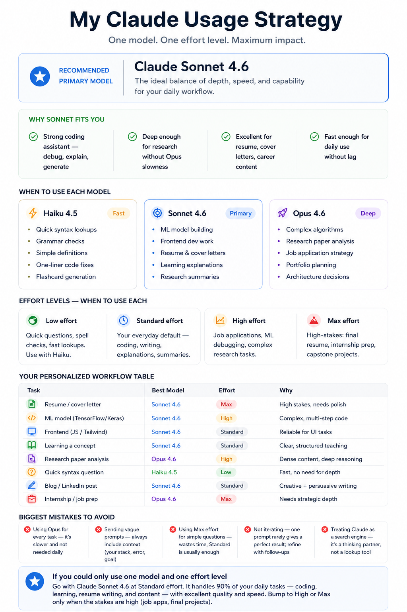

#  Day 7: Claude Model Selection & Reasoning Effort

Welcome to Day 7 of my **60-Day AI & Coding Challenge**! Today's focus was on understanding how to optimize AI resources by choosing the right Claude models (Haiku, Sonnet, Opus) and managing **Reasoning Effort** configurations to build a highly efficient learning and coding workflow.

---
**The goal was to understand:**

Which model is best for coding tasks

When to use different effort levels

How to improve productivity with AI

Common mistakes to avoid while using AI assistants

---

**Key Learnings**

Sonnet 4.6 is the best all-round model for most daily tasks.

Haiku 4.5 is ideal for quick questions and lightweight tasks.

Opus 4.6 is most useful for deep research and complex reasoning.

Providing clear context significantly improves AI responses.

---
**Skills Practiced**

AI Workflow Design

Prompt Engineering

Productivity Optimization

AI Model Selection

Research & Analysis

---

