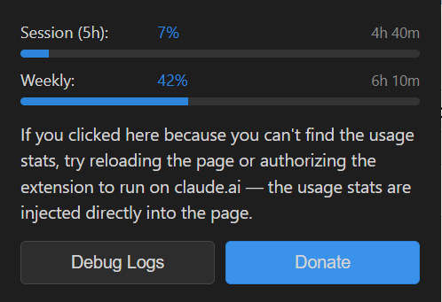
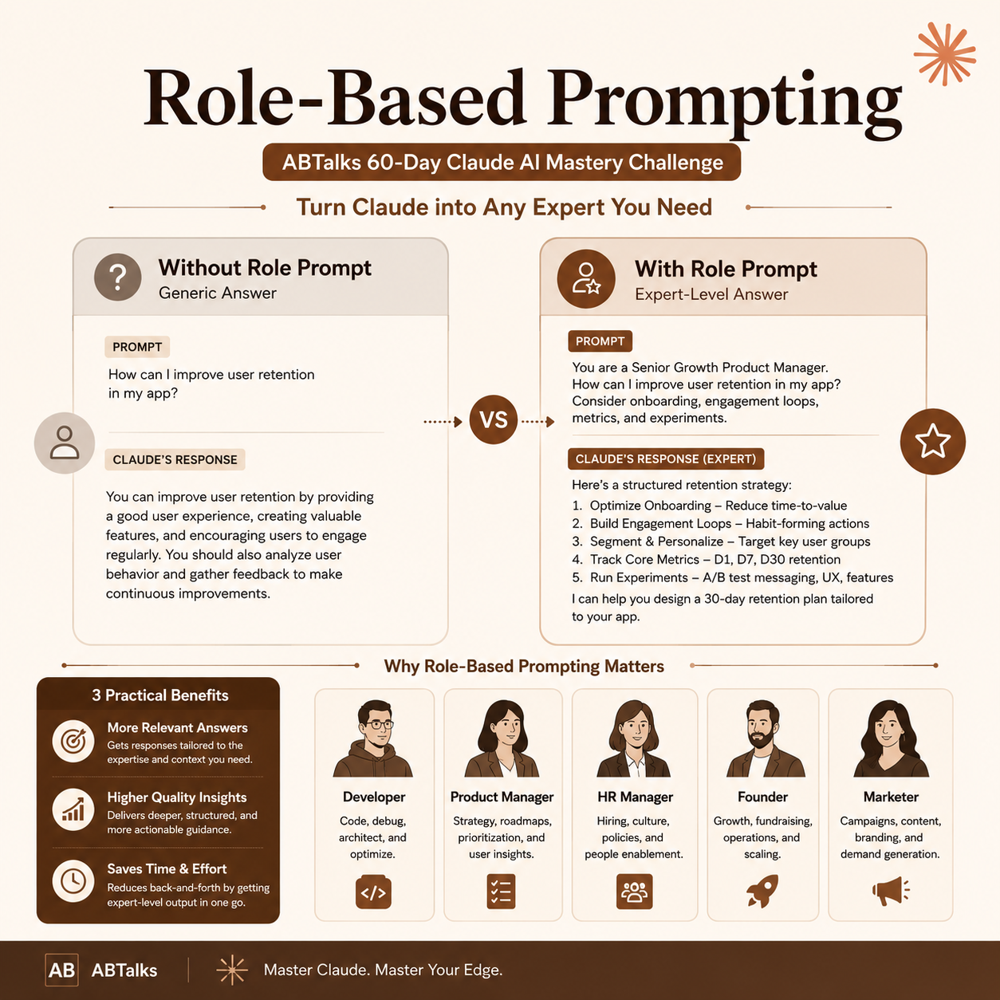

# 📂 Day 3: Role-Based Prompting Workspace

Welcome to the Day 3 workspace of my **ABTalks 60-Day Claude AI Mastery Challenge**. This module focuses on understanding and implementing **Role-Based Prompting** to extract expert-level, highly specialized intelligence from Claude, rather than generic baseline answers.

---

## 🎯 Day 3 Task Objectives
1. **Understand Persona Dynamics:** Learn how assigning specific professional roles shifts Claude’s reasoning matrix and constraints.
2. **Execute Comparative Testing:** Run an identical architectural question through an unprompted state, a **Founder Persona**, and a **Senior Developer Persona**.
3. **Implement Usage Guardrails:** Install and pin the **Claude Usage Counter** Chrome extension to monitor live token and rate-limit consumption.

---

## 🧪 Experiment Summary: Founder vs. Engineer

The core question tested in this lab was:  
> *"Should we build a real-time chat feature from scratch or use a third-party API?"*

### 💼 The Founder's Verdict: **Outsource to an API**
* **Core Drivers:** Time-to-market, extending cash runway, avoiding pre-optimization bottlenecks.
* **Logic:** Building a WebSocket network protocol from scratch consumes 3–4 months of core engineering time, delaying product-market fit. Use a tool like **Stream**, **Twilio**, or **Sendbird** to validate demand first.

### 💻 The Senior Engineer's Verdict: **Build It Internally**
* **Core Drivers:** Strict code ownership, zero vendor lock-in, data sovereignty, and clean system architecture.
* **Logic:** Relying on third-party SDKs introduces permanent architectural debt. Instead, spend 6–8 weeks architecting a phased internal build using core, production-stable building blocks like **WebSockets**, **PostgreSQL (JSONB columns)**, and **Redis**.

---

## 🔧 Tool Tracking Interface & Active Workspace
As part of the daily workspace routine, the **Claude Usage Counter** extension was added to monitor active hourly/weekly metrics directly inside the active prompt workspace. 

As captured below in `image_1df6c5.png`, the extension dynamically tracks real-time usage (Session at 7%, Weekly at 42%) right overlaying my experimental environment, where active sessions like *AI personality profile for startup founder* and *Understanding prompt engineering* were carried out:

---

